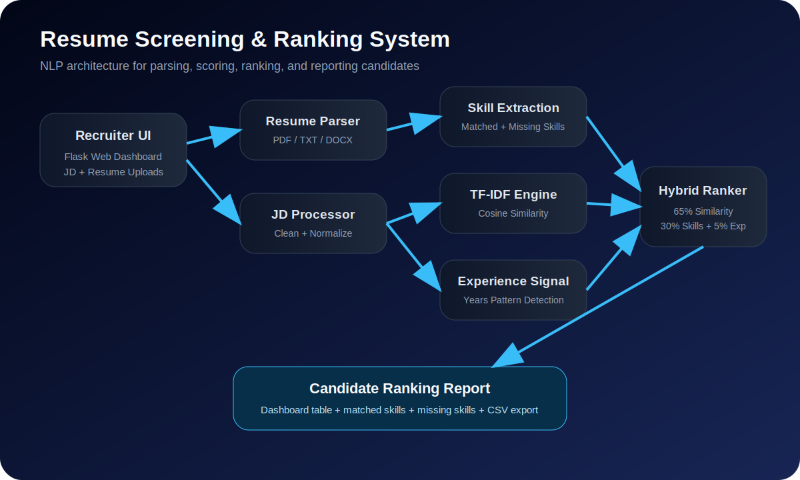
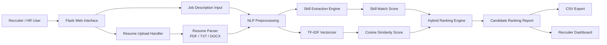
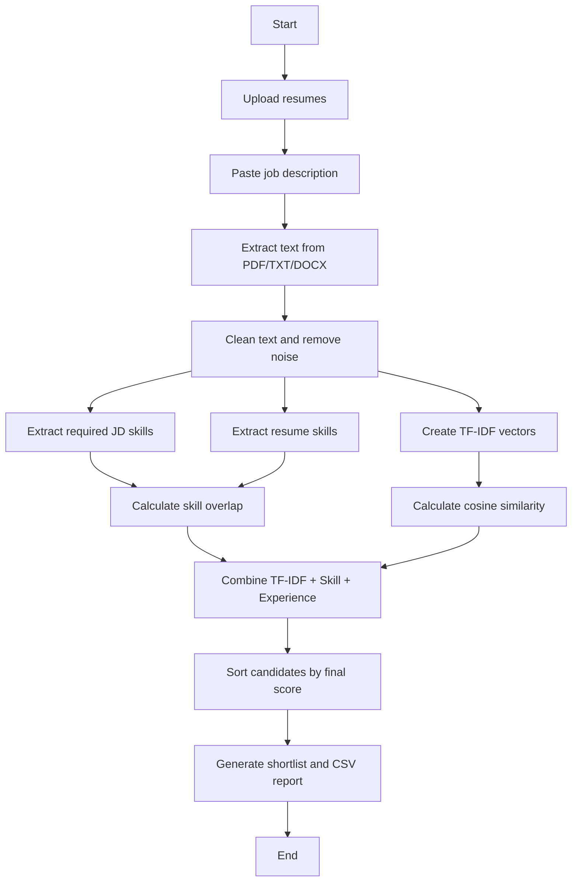

# Resume Screening & Ranking System


**Author:** Darshan Paapani  
**Project Level:** Intermediate  
**Domain:** Artificial Intelligence, Machine Learning, NLP, HR Analytics  
**Project Type:** Recruiter-facing AIML portfolio project

---

## Executive Summary

The **Resume Screening & Ranking System** is an NLP-powered web application that helps recruiters quickly shortlist candidates by comparing uploaded resumes against a job description.

The system parses resumes in **PDF, TXT, or DOCX** format, extracts candidate details and skills, calculates job-description similarity using **TF-IDF + cosine similarity**, applies a skill-overlap scoring layer, and produces an explainable ranked candidate report.

Instead of only saying *“Candidate A is better than Candidate B,”* this system explains **why** a candidate ranked higher by showing:

- Overall candidate score
- TF-IDF similarity score
- Skill match percentage
- Matched skills
- Missing skills
- Years-of-experience signal
- Recruiter recommendation
- Downloadable CSV shortlist report

> Resume line: Developed an NLP-based resume screening tool that ranks candidates by job-description similarity, reducing manual screening time by an estimated 60%.

---

## Business Problem

Recruiters often review hundreds of resumes manually for one opening. This process is slow, inconsistent, and vulnerable to human fatigue.

This project solves a practical hiring workflow problem:

> **Given a job description and multiple candidate resumes, automatically rank candidates based on job relevance and explain the reason behind each ranking.**

---

## Key Features

| Feature | Description |
|---|---|
| Resume Upload | Supports PDF, TXT, and DOCX resumes |
| Job Description Input | Recruiter can paste any job description |
| NLP Similarity Scoring | Uses TF-IDF and cosine similarity |
| Skill Extraction | Extracts skills from both job description and resumes |
| Hybrid Ranking | Combines text similarity, skill match, and experience signal |
| Explainable Results | Shows matched skills, missing skills, and recommendation |
| CSV Export | Downloads candidate ranking report |
| Flask Dashboard | Simple business-facing web interface |
| Testing | Includes unit tests for parser, skill extraction, and ranker |
| CI Ready | GitHub Actions workflow included |

---

## Tech Stack

| Layer | Technology |
|---|---|
| Programming | Python |
| Web Framework | Flask |
| NLP | TF-IDF, cosine similarity, skill extraction |
| ML Utilities | Scikit-learn |
| Resume Parsing | pypdf, python-docx, text parser |
| Data Handling | Pandas, NumPy |
| Testing | Pytest |
| Deployment Ready | Gunicorn, Docker |
| Documentation | Markdown, Mermaid, SVG animation |

---

## System Architecture

### Image-Style Architecture



### Mermaid Architecture



---

## Animated Algorithm Explanation

The animation below shows how a resume travels through the ranking pipeline.


### Step-by-Step Algorithm Flow



### Simple Explanation for Non-Technical Readers

Imagine a recruiter gives the system one job description and ten resumes.

The system does four things:

1. **Reads every resume** like a recruiter would.
2. **Finds important skills** such as Python, SQL, NLP, Flask, Docker, and Machine Learning.
3. **Compares each resume with the job description** to see which candidate is most relevant.
4. **Ranks candidates** and explains which skills matched and which skills are missing.

So the output is not just a score. It is a practical shortlist report.

---

## How the Scoring Works

The default scoring strategy is **Hybrid Ranking**.

```text
Final Score = 65% TF-IDF Similarity + 30% Skill Match + 5% Experience Signal
```

### 1. TF-IDF Similarity

TF-IDF gives higher importance to meaningful words and lower importance to very common words.

Example:

- Words like `the`, `and`, `with` are not very useful.
- Words like `Python`, `NLP`, `Flask`, `Docker`, and `Machine Learning` are highly useful.

The system converts the job description and each resume into numerical vectors, then uses **cosine similarity** to measure how close they are.

### 2. Skill Match Score

The system extracts skills from the job description and resume using a curated skill catalog.

Example:

```text
Job Skills: Python, SQL, NLP, Flask, Docker
Resume Skills: Python, NLP, Flask
Matched Skills: Python, NLP, Flask
Missing Skills: SQL, Docker
Skill Match Score: 3 / 5 = 60%
```

### 3. Experience Signal

The system looks for patterns like:

```text
3 years of experience
5+ yrs
experience: 2 years
```

This is not the main ranking factor, but it adds a small practical signal.

---

## Project Structure

```text
resume-screening-ranking-system/
│
├── app/
│   ├── __init__.py
│   └── routes.py
│
├── src/
│   ├── config.py
│   ├── nlp_utils.py
│   ├── ranker.py
│   ├── reporting.py
│   ├── resume_parser.py
│   └── skills.py
│
├── templates/
│   ├── base.html
│   ├── index.html
│   └── results.html
│
├── static/
│   └── css/
│       └── style.css
│
├── data/
│   └── skills_catalog.json
│
├── sample_data/
│   ├── job_description.txt
│   └── resumes/
│       ├── resume_aarav_ml_engineer.txt
│       ├── resume_neha_data_analyst.txt
│       └── resume_rohan_frontend.txt
│
├── assets/
│   ├── system_architecture.svg
│   ├── system_architecture.mmd
│   ├── algorithm_flow.mmd
│   └── ranking_algorithm_animation.svg
│
├── tests/
│   ├── test_ranker.py
│   ├── test_resume_parser.py
│   └── test_skills.py
│
├── uploads/
├── outputs/
├── notebooks/
├── .github/workflows/tests.yml
├── app.py
├── Dockerfile
├── requirements.txt
├── pyproject.toml
├── .gitignore
├── LICENSE
└── README.md
```

---

## Installation

### 1. Clone the repository

```bash
git clone https://github.com/YOUR-USERNAME/resume-screening-ranking-system.git
cd resume-screening-ranking-system
```

### 2. Create virtual environment

Windows:

```bash
python -m venv venv
venv\Scripts\activate
```

Mac/Linux:

```bash
python -m venv venv
source venv/bin/activate
```

### 3. Install dependencies

```bash
python -m pip install --upgrade pip
pip install -r requirements.txt
```

---

## How to Run

```bash
python app.py
```

Then open:

```text
http://127.0.0.1:5000
```

---

## Quick Demo Using Sample Data

1. Open `sample_data/job_description.txt`.
2. Copy the job description.
3. Run the Flask app.
4. Upload the sample resumes from `sample_data/resumes/`.
5. Click **Rank Candidates**.
6. Download the CSV report.

Expected ranking:

| Rank | Candidate Type | Why |
|---|---|---|
| 1 | AI/ML Engineer | Strong Python, ML, NLP, Flask, Docker match |
| 2 | Data Analyst | Good analytics skills but weaker ML deployment skills |
| 3 | Frontend Developer | Strong software profile but low AIML relevance |

---

## Run Tests

```bash
pytest
```

Expected result:

```text
5 passed
```

---

## Docker Run

Build the image:

```bash
docker build -t resume-ranking-system .
```

Run the container:

```bash
docker run -p 5000:5000 resume-ranking-system
```

Open:

```text
http://127.0.0.1:5000
```

---

## Scoring Methods Available

| Method | Description | Best Use Case |
|---|---|---|
| TF-IDF | Pure job-description similarity | Quick semantic comparison |
| Skills | Skill overlap only | Skill-based screening |
| Hybrid | TF-IDF + skill match + experience | Recommended recruiter workflow |

---

## Recruiter Value

This project shows the ability to:

- Build an end-to-end NLP application
- Convert unstructured text into measurable features
- Design explainable AI scoring logic
- Build a Flask-based business dashboard
- Write clean modular Python code
- Add tests and CI workflow
- Create recruiter-friendly documentation

---

## Limitations

This project is a portfolio-grade screening assistant, not a final hiring decision system.

Important limitations:

- Resume formatting can affect PDF parsing accuracy.
- Skill extraction depends on the skill catalog.
- TF-IDF does not deeply understand context like large language models.
- The system should not be used as the only hiring filter.
- Human review is still required for fairness and quality.

---

## Future Enhancements

| Enhancement | Impact |
|---|---|
| Sentence-BERT embeddings | Better semantic understanding |
| Named Entity Recognition | Improved education/company extraction |
| Bias audit module | More responsible AI screening |
| Admin dashboard | Recruiter workflow management |
| Database storage | Historical candidate tracking |
| REST API | Integration with ATS systems |
| Streamlit analytics version | Faster demo deployment |
| LLM-based explanation | More natural recruiter insights |

---

## Resume Bullet Points

- Developed an NLP-based resume screening and ranking system using Flask, TF-IDF, cosine similarity, and skill extraction to automate candidate shortlisting.
- Built an explainable hybrid scoring engine combining job-description similarity, skill overlap, and experience signals to rank candidates with transparent recommendations.
- Designed a recruiter-facing dashboard with resume upload, ranking visualization, matched/missing skills, and CSV export, reducing estimated manual screening time by 60%.
- Implemented modular Python architecture with unit tests, CI workflow, Docker support, and production-ready documentation.

---

## LinkedIn Post Caption

I built a Resume Screening & Ranking System using Python, Flask, NLP, and Scikit-learn.

The application parses resumes, compares them with a job description, extracts skills, ranks candidates using TF-IDF similarity and skill matching, and generates an explainable shortlist report.

Key features:
- PDF/TXT/DOCX resume parsing
- Job-description similarity scoring
- Matched and missing skill analysis
- Hybrid candidate ranking
- CSV report export
- Flask-based recruiter dashboard

This project helped me understand how NLP can be applied to real-world HR and recruitment workflows.

---

## Author

**Darshan Paapani**
